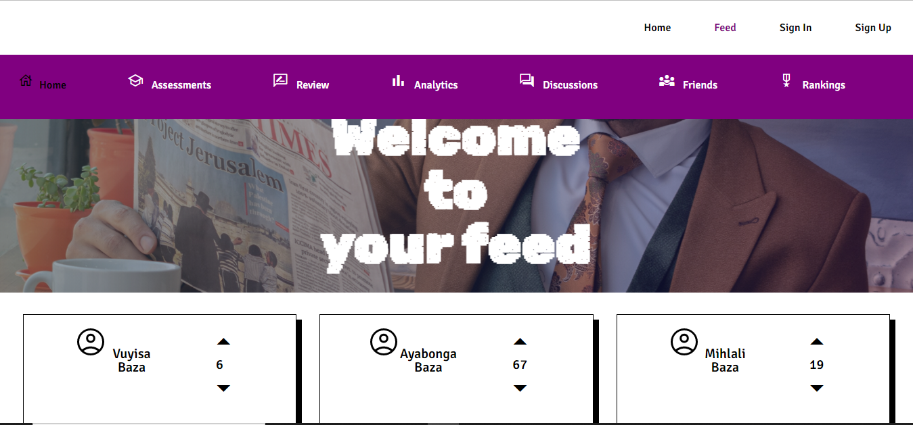

# Bazachat 

This app was built as part of my honors research project. This project was conducted with the aim of designing and building a WebRTC-based
web application to help first-year university students to interact with each other and
engage in school work. This was achieved by using a very Robust technology stack called
MERN, which includes MongoDB for the back-end database, Express.js for middleware
and building an API to the database, React.js for building the UI, and Node.js for building
the application server.

It provides the following functionality
1. Instant messaging
2. File sharing
3. Audio calling
4. Video calling
5. dicussions forum
6. rewards forum
7. peer assements
8. peer review

Check out the live demo: https://rtctest11.herokuapp.com/

This app was built using MongoDB, NodeJS, Mongoose, Express.js, React.js, Socket.io, and WebRTC (using the EasyRTC framework)

## How to run the project?

1. Clone this repository in your local system.
2. Open the command prompt from your project directory and run the command `npm install`.
3. Open the command prompt from your project directory and run the command `npm start`.
4. Go to your browser and type `http://127.0.0.1:3000/` in the address bar.
5. Hurray! That's it.